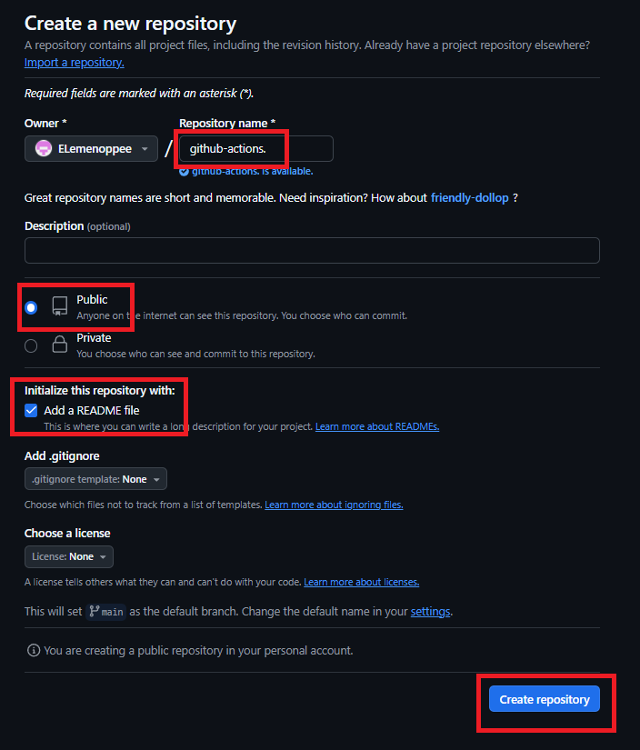

# Phase 1: Learning Github Actions

As part of my DevOps learning journey, I wanted to dive into GitHub Actions to automate workflows for my projects. This exploration helped me understand how workflows, jobs, steps, and actions work together to automate tasks like Continuous Integration (CI) or Continuous Deployment (CD).

In this post, I’ll walk you through the steps I took to:

✅ 1. Create a GitHub repository for testing GitHub Actions.

✅ 2. Read about GitHub Actions concepts (Workflow, Job, Step, Action).

✅ 3. Create a .github/workflows/first-workflow.yml file.

✅ 4. Write a workflow that prints "Hello, GitHub Actions!" on push.

✅ 5. Trigger your workflow by pushing a commit.

If you’re also new to GitHub Actions, this guide will help you get started with automation in your own projects! 🚀

## Create a GitHub Repository

### Log in to GitHub

First, I logged into my GitHub account.

### Create a New Repository

After logging in, I clicked on the "Repositories" tab and then clicked the "New" button to create a new repository.


### Configure Your Repository

+ I provided a name for the repository in the "Repository name" field.
+ I made sure to set it to Public.
+ Under "Initialize this repository with", I selected the option to "Add a README file".
+ Finally, I clicked on the "Create repository" button to complete the setup.



## Understanding GitHub Actions Concepts

GitHub Actions is an incredible tool for automating workflows. Here's a quick breakdown of the core concepts I came across:

**Workflow:** This is essentially an automated set of steps that run when triggered by specific events like pushing code or opening a pull request. It’s like an automated to-do list that kicks off every time a trigger happens.

**Job:** A job is a collection of steps that run on a specific runner (virtual machine or container). These jobs are tasks within the workflow, and they can either run in parallel or sequentially, depending on how you configure them.

**Step:** A step is an individual action within a job. It could be running a command, executing a script, or using a pre-built GitHub Action. Steps define the specific tasks that get done in each job.

**Action:** An action is a reusable unit of work that performs a specific task, like setting up environments or deploying code. You can create your own or use ones shared by the GitHub community.

## Creating the Workflow File

Once the repository was set up, it was time to configure GitHub Actions by creating a workflow file.

### Go to Your Repository

I navigated to the repository I just created (in my case, github-actions).


### Access the Actions Tab

I clicked on the "Actions" tab in the repository interface.


### Set Up a New Workflow

I clicked on "set up a workflow yourself" to begin creating my first workflow.


### Name the Workflow File

I named the new file first-workflow.yml for simplicity.


## Writing the First Workflow

Now, I wrote a simple workflow that prints "Hello, GitHub Actions!" whenever there’s a push to the main branch.

### Edit the Workflow File

Inside first-workflow.yml, I pasted the following configuration:

```bash
name: First Workflow

# Controls when the workflow will run
on:
  # Triggers the workflow on push or pull request events but only for the "main" branch
  push:
    branches: [ "main" ]
  pull_request:

  # Allows you to run this workflow manually from the Actions tab
  workflow_dispatch:

# A workflow run is made up of one or more jobs that can run sequentially or in parallel
jobs:
  # This workflow contains a single job called "build"
  build:
    # The type of runner that the job will run on
    runs-on: ubuntu-latest

    # Steps represent a sequence of tasks that will be executed as part of the job
    steps:
      # Checks-out your repository under $GITHUB_WORKSPACE, so your job can access it
      - uses: actions/checkout@v4

      # Runs a single command using the runners shell
      - name: Run a one-line script
        run: echo Hello, GitHub Actions!
```


## Triggering the Workflow by Pushing a Commit

### Clone the Repository Locally

I cloned the repository to my local machine by running:

```bash
git clone https://github.com/ELemenoppee/github-actions
cd github-actions
```

Expected output:


### Create a Test File

To trigger the workflow, I created a test file with the following command:

```bash
echo "Hello" >> test.txt
```

### Commit and Push the Test File

I added, committed, and pushed the new file to the repository:

```bash
git add test.txt
git commit -m 'this is testing'
git push
```

Expected output:


### Verify the Workflow Was Triggered

After pushing the commit, the workflow was automatically triggered. I went to the Actions tab in my repository to see the status of the workflow.


The workflow ran successfully, confirming that the action was triggered and executed as expected.


## What I Learned
This project helped me understand GitHub Actions and how to automate workflows effectively. Some key takeaways:

✅ How to create a GitHub repository for testing automation workflows.

✅ Understanding the core concepts of GitHub Actions (Workflow, Job, Step, Action).

✅ Setting up a basic workflow file to automate tasks on code push.

✅ Triggering workflows by pushing commits to a GitHub repository.

Next Steps
Now that I’ve grasped the basics of GitHub Actions, I’m planning on:

+ Add a step to checkout your repository (actions/checkout).
+ Run a simple shell command in the workflow.
+ Add a step that installs dependencies (e.g., npm install, pip install).
+ Modify the workflow to only run on specific branches.
+ Use environment variables inside your workflow.

This was a valuable learning experience, and I’m eager to dive deeper into automation and CI/CD! If you’re also exploring GitHub Actions, I’d love to hear how you’re using it in your projects. 🚀