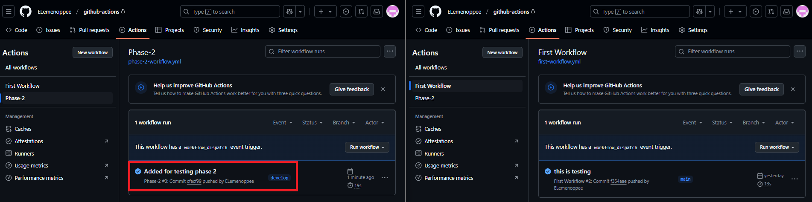
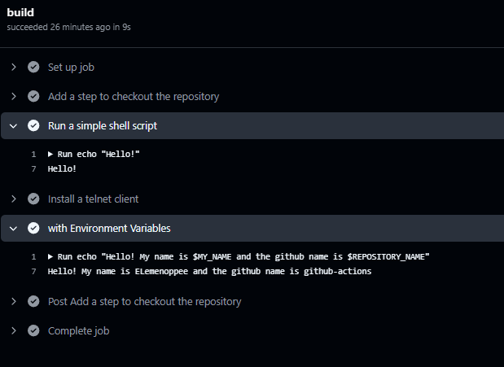

# Phase 2: Learning Github Actions

As I continue my GitHub Actions learning journey, I wanted to explore more advanced workflow automation techniques. In my previous post, I covered the basics of setting up a simple workflow. Now, I'm diving deeper into key concepts like branch-specific workflows, environment variables, and dependency installation.

In this post, I’ll walk you through the steps I took to:

✅ Add a step to checkout your repository (actions/checkout).

✅ Run a simple shell command in the workflow.

✅ Add a step that installs dependencies (e.g., npm install, pip install).

✅ Modify the workflow to only run on specific branches.

✅ Use environment variables inside your workflow.

By following along, you'll gain hands-on experience with practical GitHub Actions features that can streamline automation in your projects. Let’s get started! 🚀

## Prerequisites

### Step 1: Creating the "develop" Branch

First, I cloned my GitHub repository to my local machine:


```bash
git clone https://github.com/ELemenoppee/github-actions
```

Next, I created a new branch named develop and pushed it to the remote repository:

```bash
git checkout -b <branch_name>
git push origin develop
```

To confirm that I was on the correct branch, I ran:

```bash
git branch
```

Expected Result:

A list of branches, with develop highlighted as the active branch.


### Step 2: Creating a New Workflow File

After setting up my repository and branch, I navigated to the .github/workflows directory and created a new workflow file:

```bash
touch .github/workflow/phase-2-workflow.yml
```

This file will contain my GitHub Actions workflow configuration.

Now that everything is set up, I moved on to defining the workflow steps! 🚀

## Adding a Step to Checkout the Repository

To ensure my workflow could access my repository, I added the following step:

```bash
      # Checks-out your repository under $GITHUB_WORKSPACE, so your job can access it
      - name: Add a step to checkout the repository
        uses: actions/checkout@v4
```

This allowed the workflow to check out my repository under $GITHUB_WORKSPACE, making it accessible for subsequent steps.

## Running a Simple Shell Command

I added a basic shell command to test if the workflow was running properly:

```bash
      # Running a simple shell command in the workflow
      - name: Run a simple shell script
        run: echo "Hello!"
```

This command prints "Hello!" in the GitHub Actions log when the workflow executes.

## Installing Dependencies

Since my workflow required additional tools, I added a step to install a Telnet client:

```bash
      # Adding a step that installs dependencies
      - name: Install a telnet client
        run: |
          sudo apt update
          sudo apt install telnet
          telnet --version
```

## Configuring the Workflow to Run on a Specific Branch

Since I was working with the develop branch, I wanted the workflow to trigger only when changes were pushed to it.

I modified the workflow file to include:

```bash
on:
  push:
    branches:
      # - main
      - develop      
  pull_request:
```

With this setup, the workflow runs whenever I push changes to develop or open a pull request.

## Using Environment Variables in My Workflow

I added environment variables to store reusable values within the workflow.

+ $MY_NAME: Defined inside a job, accessible only within that job.
+ $REPOSITORY_NAME: Defined globally, accessible across all jobs.

```bash
# This environment variable can be use in all the jobs in this workflow
env:
  REPOSITORY_NAME: "github-actions"

      # Use environment variables inside your workflow
      - name: with Environment Variables
        run: echo "Hello! My name is $MY_NAME and the github name is $REPOSITORY_NAME"
```

## My Complete Workflow File

After implementing all the steps, my full workflow file looked like this:

```bash
name: First Workflow

on:
  push:
    branches:
      # - main
      - develop      
  pull_request:

  workflow_dispatch:

# This environment variable can be use in all the jobs in this workflow
env:
  REPOSITORY_NAME: "github-actions"

jobs:
  build:
    runs-on: ubuntu-latest
  # environment variable that can be use inside this job
    env:
      MY_NAME: "ELemenoppee"

    steps:
      # Checks-out your repository under $GITHUB_WORKSPACE, so your job can access it
      - name: Add a step to checkout the repository
        uses: actions/checkout@v4

      # Running a simple shell command in the workflow
      - name: Run a simple shell script
        run: echo "Hello!"

      # Adding a step that installs dependencies
      - name: Install a telnet client
        run: |
          sudo apt update
          sudo apt install telnet
          telnet --version

      # Use environment variables inside your workflow
      - name: with Environment Variables
        run: echo "Hello! My name is $MY_NAME and the github name is $REPOSITORY_NAME"
```

## Testing My Workflow

To test if the workflow was running correctly, I created a new file:

```bash
echo "Hello Phase 2" >> phase2.txt
```

I then committed and pushed it to the develop branch:

```bash
git checkout develop
git status              // to check the status of the file
git add *
git commit -m 'Added for testing phase 2'
git push origin develop
```

Expected output:


## Verifying the Workflow Execution

Finally, I checked whether my workflow was executing properly:



Success! My GitHub Actions workflow was set up and running smoothly. 🎉



## What I Learned

This project helped me deepen my understanding of GitHub Actions and how to automate workflows more effectively. Some key takeaways:

✅ How to create and manage branches for workflow automation.

✅ Setting up a GitHub Actions workflow inside .github/workflows/.

✅ Using actions/checkout to access my repository within a workflow.

✅ Running shell commands inside a GitHub Actions workflow.

✅ Installing dependencies within a workflow (e.g., installing a Telnet client).

✅ Configuring workflows to trigger only on specific branches.

✅ Utilizing environment variables for better workflow management.

Next Steps
Now that I’ve implemented these improvements, I plan to explore:

🔹 Using GitHub Actions to build and test applications automatically.

🔹 Implementing secrets management to securely handle credentials.

🔹 Running matrix builds to test across multiple environments.

🔹 Automating deployment processes for continuous delivery (CD).

This has been an exciting step forward in my DevOps journey, and I’m eager to explore more advanced automation techniques. If you’re also working with GitHub Actions, let’s connect and share insights! 🚀